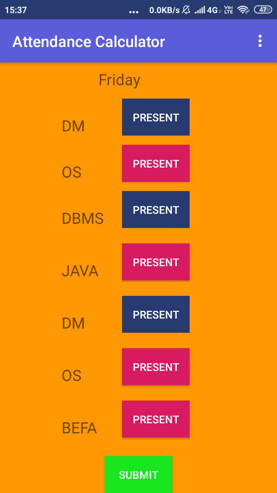
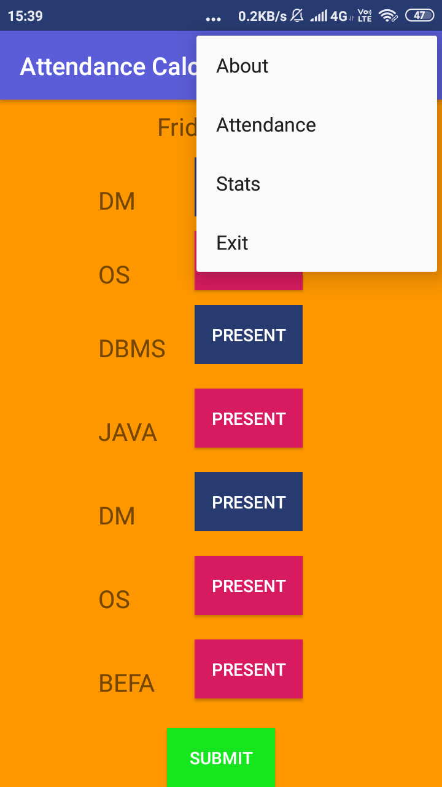
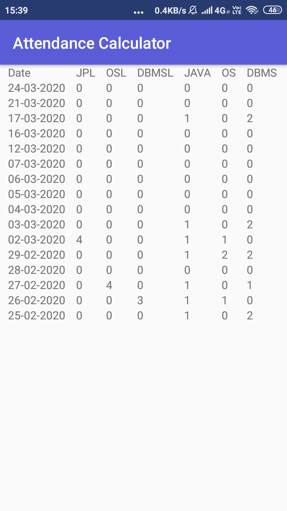
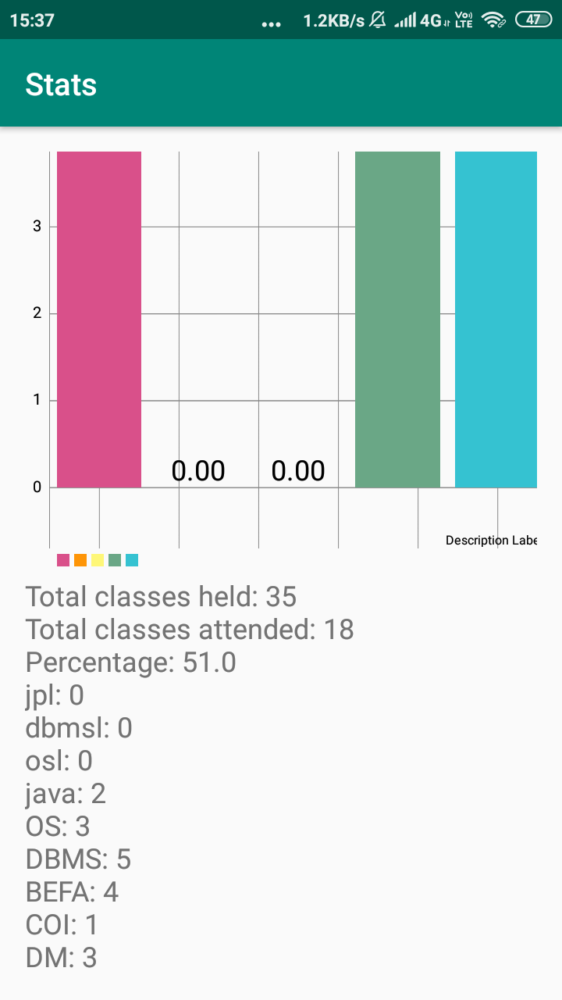

# attendance-calculator
My First  Android App
This app was to track my attendace at my college.

Two variants of the app were created:
1. With menu and non sliding feature.
2. With sliding feature and no menu.

<h3>First Variant:</h3>
<table>
  <tr>
    <td>Home Page</td>
    <td>Menu</td>
  </tr>
  <tr>
    <td>  </td>
    <td>  </td>
  </tr>
  <tr>
    <td>Attendance Page</td>
    <td>Stats Page</td>
  </tr>
  <tr>
    <td>  </td>
    <td>  </td>
  </tr>
</table>

Second Variant is similar to the first but pages are accessible by sliding rather than chosing from menu above.
